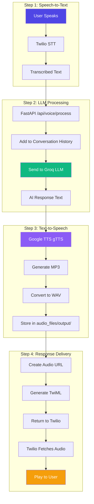

# Twilio Architecture Diagram

## Overview
This document describes the architecture of the Twilio voice call integration, showing how phone calls flow through Twilio to the FastAPI backend and back to the caller, with all components and libraries used.

## Complete Component Architecture Diagram

```mermaid
graph TB
    subgraph "Phone User"
        PHONE[Phone Device<br/>User's Phone]
    end
    
    subgraph "Twilio Cloud Platform"
        TWILIO_API[Twilio REST API<br/>twilio v8.10.0]
        TWILIO_CLIENT[TwilioClient<br/>twilio.rest.Client]
        TWILIO_STT[Twilio Speech Recognition<br/>Built-in STT Service]
        TWILIO_TTS[Twilio Text-to-Speech<br/>Fallback TTS]
        TWILIO_PHONE[Twilio Phone Number<br/>Incoming Number]
        TWILIO_WEBHOOK[Twilio Webhook Handler<br/>Receives HTTP POST]
    end
    
    subgraph "FastAPI Backend Server"
        subgraph "Framework & Server"
            FASTAPI[FastAPI<br/>v0.104.1]
            UVICORN[Uvicorn<br/>ASGI Server v0.24.0]
            CORS[CORSMiddleware<br/>Cross-Origin Support]
        end
        
        subgraph "API Endpoints"
            INCOMING[POST /api/voice/incoming<br/>Call Handler]
            PROCESS[POST /api/voice/process<br/>Speech Processor]
            AUDIO[GET /api/voice/audio/&#123;filename&#125;<br/>Audio Server]
            TWILIO_CREDS_GET[GET /api/twilio/credentials<br/>Status Check]
            TWILIO_CREDS_POST[POST /api/twilio/credentials<br/>Credential Validator]
        end
        
        subgraph "TwiML Generation"
            TWIML_VR[VoiceResponse<br/>twilio.twiml.voice_response]
            TWIML_GATHER[Gather<br/>twilio.twiml.voice_response]
            TWIML_SAY[Say<br/>TwiML Say Verb]
            TWIML_PLAY[Play<br/>TwiML Play Verb]
        end
        
        subgraph "Request Parsing"
            FORM[Form Data Parser<br/>FastAPI Form]
            QUERY[Query Parameter Parser<br/>FastAPI Query]
            REQUEST[Request Object<br/>FastAPI Request]
            MULTIPART[python-multipart<br/>v0.0.6]
        end
        
        subgraph "LLM Integration"
            GROQ_CLIENT[Groq Client<br/>groq v0.4.1]
            GROQ_CHAT[chat.completions.create<br/>LLM API Call]
            CONV_HIST[Conversation History<br/>In-Memory Dictionary]
        end
        
        subgraph "Text-to-Speech"
            GTTS[gTTS<br/>Google Text-to-Speech<br/>gtts v2.5.0]
            PYDUB[AudioSegment<br/>pydub v0.25.1]
            AUDIO_CONVERT[MP3 to WAV Converter<br/>pydub AudioSegment]
        end
        
        subgraph "File Management"
            OS[os module<br/>Standard Library]
            PATHLIB[Path<br/>pathlib Standard Library]
            AUDIO_DIR[audio_files/output/<br/>Directory Storage]
            FILE_RESPONSE[FileResponse<br/>FastAPI File Serving]
        end
        
        subgraph "Logging System"
            JSON_LOGGER[JSONLogger Class<br/>Custom Logger]
            LOG_FILE[app_logs.json<br/>Structured Logs]
            PYTHON_LOG[Python logging<br/>Standard Library]
            DATETIME[datetime<br/>Standard Library]
        end
        
        subgraph "Environment & Config"
            DOTENV[python-dotenv<br/>v1.0.0]
            ENV_VARS[Environment Variables<br/>.env file]
            TWILIO_CREDS_STORAGE[TWILIO_CREDENTIALS<br/>In-Memory Dictionary]
        end
        
        subgraph "Validation"
            VALIDATE_FUNC[validate_twilio_credentials<br/>Custom Function]
            ACCOUNT_FETCH[account.fetch<br/>Twilio API Validation]
            PHONE_VERIFY[incoming_phone_numbers.list<br/>Phone Number Verification]
        end
    end
    
    subgraph "External Services"
        GROQ_API[Groq API<br/>LLM Service<br/>llama-3.3-70b-versatile]
    end
    
    %% Call Flow
    PHONE -->|1. Dials| TWILIO_PHONE
    TWILIO_PHONE -->|2. Webhook| TWILIO_WEBHOOK
    TWILIO_WEBHOOK -->|3. POST Request| INCOMING
    
    %% Incoming Call Processing
    INCOMING --> FORM
    INCOMING --> CONV_HIST
    INCOMING --> TWIML_VR
    TWIML_VR --> TWIML_SAY
    TWIML_VR --> TWIML_GATHER
    INCOMING --> JSON_LOGGER
    INCOMING -->|4. TwiML Response| TWILIO_PHONE
    TWILIO_PHONE -->|5. Play Audio| PHONE
    
    %% Speech Processing Flow
    PHONE -->|6. User Speaks| TWILIO_STT
    TWILIO_STT -->|7. Transcribed Text| TWILIO_WEBHOOK
    TWILIO_WEBHOOK -->|8. POST Request| PROCESS
    
    %% Process Speech Pipeline
    PROCESS --> FORM
    PROCESS --> QUERY
    PROCESS --> CONV_HIST
    CONV_HIST --> GROQ_CLIENT
    GROQ_CLIENT --> GROQ_CHAT
    GROQ_CHAT --> GROQ_API
    GROQ_API -->|9. AI Response| GROQ_CHAT
    GROQ_CHAT -->|10. Text Response| PROCESS
    
    %% TTS Generation
    PROCESS --> GTTS
    GTTS -->|11. Generate MP3| AUDIO_CONVERT
    AUDIO_CONVERT --> PYDUB
    PYDUB -->|12. Convert to WAV| AUDIO_DIR
    AUDIO_DIR --> OS
    OS --> PATHLIB
    
    %% TwiML Response Generation
    PROCESS --> TWIML_VR
    TWIML_VR --> TWIML_PLAY
    TWIML_PLAY -->|13. Audio URL| AUDIO
    TWIML_VR --> TWIML_GATHER
    PROCESS --> JSON_LOGGER
    PROCESS -->|14. TwiML Response| TWILIO_PHONE
    
    %% Audio Serving
    TWILIO_PHONE -->|15. Fetch Audio| AUDIO
    AUDIO --> FILE_RESPONSE
    FILE_RESPONSE --> PATHLIB
    PATHLIB --> AUDIO_DIR
    AUDIO_DIR -->|16. WAV File| TWILIO_PHONE
    TWILIO_PHONE -->|17. Play Audio| PHONE
    
    %% Twilio Credentials Management
    TWILIO_CREDS_POST --> FORM
    TWILIO_CREDS_POST --> VALIDATE_FUNC
    VALIDATE_FUNC --> TWILIO_CLIENT
    TWILIO_CLIENT --> TWILIO_API
    TWILIO_CLIENT --> ACCOUNT_FETCH
    TWILIO_CLIENT --> PHONE_VERIFY
    TWILIO_CREDS_POST --> TWILIO_CREDS_STORAGE
    TWILIO_CREDS_GET --> TWILIO_CREDS_STORAGE
    
    %% Configuration
    FASTAPI --> DOTENV
    DOTENV --> ENV_VARS
    ENV_VARS --> TWILIO_CREDS_STORAGE
    ENV_VARS --> GROQ_CLIENT
    
    %% Server
    FASTAPI --> UVICORN
    FASTAPI --> CORS
    
    %% Logging
    INCOMING --> JSON_LOGGER
    PROCESS --> JSON_LOGGER
    TWILIO_CREDS_POST --> JSON_LOGGER
    JSON_LOGGER --> LOG_FILE
    JSON_LOGGER --> PYTHON_LOG
    JSON_LOGGER --> DATETIME
    
    style PHONE fill:#4F46E5,color:#fff
    style TWILIO_PHONE fill:#F22C3D,color:#fff
    style FASTAPI fill:#10B981,color:#fff
    style GROQ_API fill:#F59E0B,color:#fff
    style GTTS fill:#4285F4,color:#fff
    style JSON_LOGGER fill:#EC4899,color:#fff
    style GROQ_CLIENT fill:#10B981,color:#fff
```



## Detailed Component Flow

### Call Initialization Flow


### Speech Processing Pipeline



## Detailed Component List

### Twilio Components

1. **Twilio Python SDK**
   - **Library**: `twilio` v8.10.0
   - **Components Used**:
     - `twilio.rest.Client` - REST API client for credential validation
     - `twilio.twiml.voice_response.VoiceResponse` - TwiML response builder
     - `twilio.twiml.voice_response.Gather` - Speech input collection
   - **API Methods**:
     - `api.accounts(account_sid).fetch()` - Account validation
     - `incoming_phone_numbers.list()` - Phone number verification

2. **Twilio Cloud Services**
   - **Speech Recognition**: Built-in STT (Speech-to-Text)
   - **Text-to-Speech**: Fallback TTS service
   - **Webhook Handler**: Receives HTTP POST requests
   - **Phone Number**: Incoming call number

### Backend Components (FastAPI)

1. **Framework & Server**
   - `FastAPI` v0.104.1 - Web framework
   - `uvicorn` v0.24.0 - ASGI server
   - `CORSMiddleware` - Cross-origin resource sharing

2. **API Endpoints**

   **POST /api/voice/incoming**
   - **Components**:
     - `Form()` - Extracts CallSid and From parameters
     - `VoiceResponse()` - Creates TwiML response
     - `Say()` - Text-to-speech verb
     - `Gather()` - Speech input collection
     - `JSONLogger` - Logs incoming call event
   - **Libraries**: `twilio.twiml.voice_response`, `fastapi.Form`

   **POST /api/voice/process**
   - **Components**:
     - `Form()` - Extracts SpeechResult
     - `Query()` - Extracts call_sid
     - `Request` - Gets base URL for audio links
     - `conversations` dictionary - Conversation history storage
     - `get_llm_response()` - LLM processing function
     - `generate_tts_audio()` - TTS generation function
     - `VoiceResponse()` - TwiML response builder
     - `Play()` - Audio playback verb
     - `JSONLogger` - Logs all processing steps
   - **Libraries**: `fastapi`, `groq`, `gtts`, `pydub`, `twilio.twiml`

   **GET /api/voice/audio/{filename}**
   - **Components**:
     - `FileResponse` - Serves WAV files
     - `os.path.exists()` - File existence check
     - `pathlib.Path` - Path handling
   - **Libraries**: `fastapi.responses.FileResponse`, `os`, `pathlib`

   **POST /api/twilio/credentials**
   - **Components**:
     - `Form()` - Extracts credentials
     - `validate_twilio_credentials()` - Format validation
     - `TwilioClient()` - API client for validation
     - `TWILIO_CREDENTIALS` - In-memory storage
     - `JSONLogger` - Logs credential events
   - **Libraries**: `twilio.rest.Client`, `fastapi.Form`

3. **TwiML Generation**
   - `VoiceResponse()` - Main TwiML builder
   - `Gather()` - Speech input collection
   - `Say()` - Text-to-speech output
   - `Play()` - Audio file playback
   - **Library**: `twilio.twiml.voice_response` v8.10.0

4. **LLM Integration**
   - `Groq()` - Client initialization
   - `chat.completions.create()` - LLM API call
   - **Library**: `groq` v0.4.1
   - **Model**: `llama-3.3-70b-versatile` (configurable)
   - **Parameters**: temperature=1, max_tokens=1024

5. **Text-to-Speech (TTS)**
   - `gTTS()` - Google Text-to-Speech generator
   - `AudioSegment.from_mp3()` - MP3 file loader
   - `audio.export(format="wav")` - WAV file converter
   - **Libraries**: 
     - `gtts` v2.5.0 - Google TTS
     - `pydub` v0.25.1 - Audio conversion
   - **Process**: Text → MP3 → WAV conversion

6. **File Management**
   - `os` - Standard library for file operations
   - `pathlib.Path` - Path handling
   - `os.makedirs()` - Directory creation
   - `os.path.exists()` - File existence check
   - **Storage**: `audio_files/output/` directory

7. **Logging System**
   - `JSONLogger` - Custom class for structured logging
   - `logging` - Python standard library
   - `json` - JSON serialization
   - `datetime` - Timestamp generation
   - **Storage**: `logs/app_logs.json`
   - **Event Types**: call_incoming, stt, llm, tts, speech_processing

8. **Environment & Configuration**
   - `python-dotenv` v1.0.0 - Environment variable loading
   - `os.getenv()` - Environment variable access
   - `.env` file - Configuration storage
   - **Variables**: GROQ_API_KEY, TWILIO_ACCOUNT_SID, TWILIO_AUTH_TOKEN, etc.

9. **Request Parsing**
   - `Form()` - Form data parsing
   - `Query()` - Query parameter parsing
   - `Request` - Request object
   - `python-multipart` v0.0.6 - Multipart form support

10. **Validation Functions**
    - `validate_twilio_credentials()` - Custom validation function
    - Validates: Account SID format, Auth token length, Phone number format
    - Tests credentials with Twilio API

## Backend Endpoints with Components

### 1. POST /api/voice/incoming
**Purpose**: Initial call handler when Twilio receives a call

**Components Used**:
- `Form()` - Extracts `CallSid` and `From`
- `VoiceResponse()` - Creates TwiML response
- `Say()` - Greeting message
- `Gather()` - Starts speech recognition
- `conversations` dictionary - Initializes session
- `JSONLogger.log_event()` - Logs call event

**Flow**:
```
Twilio Webhook → Form() extracts CallSid & From
    ↓
conversations[CallSid] = [system_prompt]
    ↓
VoiceResponse() + Say() + Gather()
    ↓
JSONLogger.log_event("call_incoming")
    ↓
Return TwiML XML Response
```

**TwiML Response**:
```xml
<Response>
    <Say voice="alice">Hello! Please speak.</Say>
    <Gather input="speech" action="/api/voice/process?call_sid={CallSid}" method="POST" speech_timeout="auto"/>
</Response>
```

### 2. POST /api/voice/process
**Purpose**: Main voice processing pipeline

**Components Used**:
- `Form()` - Extracts `SpeechResult`
- `Query()` - Extracts `call_sid`
- `Request` - Gets base URL
- `conversations[call_sid]` - Conversation history
- `get_llm_response()` - LLM processing
- `generate_tts_audio()` - TTS generation
- `gTTS()` - Google TTS
- `AudioSegment` - Audio conversion
- `VoiceResponse()` - TwiML builder
- `Play()` - Audio playback
- `JSONLogger` - Step-by-step logging

**Processing Steps**:
1. **STT (Speech-to-Text)**: Already done by Twilio
   - Receives `SpeechResult` via `Form()`
   - Validates with `len()` check

2. **LLM Processing**:
   - Retrieves `conversations[call_sid]`
   - Calls `get_llm_response()` with `Groq()` client
   - Updates conversation history (max 10 messages)

3. **TTS (Text-to-Speech)**:
   - Calls `generate_tts_audio()`
   - Uses `gTTS()` to create MP3
   - Uses `AudioSegment.from_mp3()` and `export(format="wav")`
   - Stores in `audio_files/output/` using `os.path`

4. **Response Generation**:
   - Creates `VoiceResponse()`
   - Adds `Play()` with audio URL
   - Falls back to `Say()` if TTS fails
   - Adds `Gather()` to continue listening

**TwiML Response**:
```xml
<Response>
    <Play>{audio_url}</Play>
    <Gather input="speech" action="/api/voice/process?call_sid={call_sid}" method="POST" speech_timeout="auto"/>
    <Hangup/>
</Response>
```

### 3. GET /api/voice/audio/{filename}
**Purpose**: Serves generated audio files to Twilio

**Components Used**:
- `FileResponse` - FastAPI file serving
- `os.path.exists()` - File validation
- `pathlib.Path` - Path construction

**Flow**:
```
Twilio requests audio URL
    ↓
os.path.exists() checks file
    ↓
FileResponse() serves WAV file
    ↓
Twilio plays audio to caller
```

## Conversation Management

### Session Management
- Each call gets unique `CallSid` from Twilio
- Conversation history stored in memory: `conversations[CallSid]`
- History includes system prompt + user/assistant messages
- Limited to last 10 messages (CONVERSATION_HISTORY_LIMIT)

### Conversation Structure
```python
conversations[CallSid] = [
    {"role": "system", "content": SYSTEM_PROMPT},
    {"role": "user", "content": "User message 1"},
    {"role": "assistant", "content": "AI response 1"},
    {"role": "user", "content": "User message 2"},
    # ... up to 10 messages
]
```

## Audio Processing

### TTS Pipeline
```
AI Response Text
    ↓
gTTS.generate() → MP3 file
    ↓
pydub.AudioSegment.from_mp3() → Audio object
    ↓
audio.export(format="wav") → WAV file
    ↓
Store in audio_files/output/
    ↓
Create HTTP URL: /api/voice/audio/{filename}
    ↓
Twilio fetches and plays
```

### Audio File Management
- Files stored in: `audio_files/output/`
- Naming: `tts_{call_sid}_{random}.wav`
- Served via FastAPI static file endpoint
- Files persist on server (consider cleanup in production)

## Error Handling

### Fallback Mechanisms
1. **TTS Failure**: Falls back to Twilio's built-in TTS
   ```xml
   <Say voice="alice">{ai_response}</Say>
   ```

2. **Empty Speech**: Re-prompts user to speak
   ```xml
   <Gather input="speech" ... />
   ```

3. **LLM Error**: Returns error message via TTS

## Logging & Monitoring

### JSON Logger
- All events logged to `logs/app_logs.json`
- Event types: `call_incoming`, `stt`, `llm`, `tts`, `speech_processing`
- Tracks timestamps, durations, call SIDs
- Structured data for analysis

### Log Events
```json
{
  "timestamp": "2024-01-01T12:00:00",
  "event_type": "speech_processing",
  "call_sid": "CA123...",
  "step": "complete",
  "data": {"turn_number": 1},
  "duration_seconds": 2.5
}
```

## Twilio Configuration

### Credential Management
- Credentials can be set via UI or .env file
- UI-set credentials override .env
- Validation before storage:
  - Account SID format check
  - Auth token length check
  - Phone number format check
  - Twilio API validation

### Webhook Configuration
- Twilio phone number must be configured with:
  - **Webhook URL**: `{API_URL}/api/voice/incoming`
  - **Method**: POST
  - **Status Callback**: (optional)

## Complete Technology Stack

### Backend Dependencies (requirements.txt)

1. **Web Framework**
   - `fastapi==0.104.1` - Modern web framework
   - `uvicorn[standard]==0.24.0` - ASGI server

2. **Twilio Integration**
   - `twilio==8.10.0` - Twilio Python SDK
   - Components: `twilio.rest.Client`, `twilio.twiml.voice_response`

3. **LLM Integration**
   - `groq==0.4.1` - Groq Python SDK
   - Model: `llama-3.3-70b-versatile` (configurable)

4. **Text-to-Speech**
   - `gtts==2.5.0` - Google Text-to-Speech
   - `pydub==0.25.1` - Audio processing (MP3 to WAV conversion)

5. **Environment & Configuration**
   - `python-dotenv==1.0.0` - Environment variable management

6. **Request Handling**
   - `python-multipart==0.0.6` - Multipart form data support
   - `pydantic==2.5.0` - Data validation

7. **HTTP Client**
   - `httpx==0.25.1` - HTTP client library

8. **File Handling**
   - `aiofiles==23.2.1` - Async file operations

9. **Standard Library Modules**
   - `os` - Operating system interface
   - `json` - JSON encoder/decoder
   - `logging` - Logging facility
   - `datetime` - Date and time handling
   - `pathlib` - Path handling

### Twilio Services

1. **Twilio Cloud Platform**
   - Phone number management
   - Webhook handling
   - Speech Recognition (STT)
   - Text-to-Speech (TTS) - Fallback
   - Call routing

2. **TwiML Verbs Used**
   - `<Say>` - Text-to-speech output
   - `<Gather>` - Speech input collection
   - `<Play>` - Audio file playback
   - `<Hangup>` - Call termination

### External APIs

1. **Groq API**
   - LLM service provider
   - Model: llama-3.3-70b-versatile
   - Endpoint: chat.completions.create

2. **Google TTS (via gTTS)**
   - Text-to-speech service
   - Generates MP3 audio files

## Security Considerations

1. **Webhook Validation**: Consider adding Twilio signature validation
2. **Audio File Cleanup**: Implement cleanup for old audio files
3. **Rate Limiting**: Consider rate limiting for voice endpoints
4. **Credential Storage**: In production, use secure storage (not memory)

## Performance Optimization

1. **Conversation History**: Limited to 10 messages to reduce LLM context
2. **Audio Caching**: Consider caching frequently used responses
3. **Async Processing**: All endpoints are async for better performance
4. **Connection Pooling**: Groq client reuses connections

## Deployment Considerations

1. **Public URL Required**: Backend must be publicly accessible for Twilio webhooks
2. **HTTPS Required**: Twilio requires HTTPS for webhooks (production)
3. **Audio URL**: Must be publicly accessible for Twilio to fetch
4. **Port Configuration**: Default port 7860 (Hugging Face Spaces)

