# UI Architecture Diagram

## Overview
This document describes the architecture of the Voice AI Assistant web UI, built with React and using the Web Speech API for real-time voice interactions.

## Complete Component Architecture Diagram

```mermaid
graph TB
    subgraph "Browser Client - React Application"
        subgraph "React Components"
            APP[App.jsx<br/>Main Component]
            STATE[React Hooks<br/>useState, useEffect, useRef]
            CALLBACK[useCallback<br/>Event Handlers]
        end
        
        subgraph "Web Speech API Integration"
            WSAPI[Web Speech API<br/>Browser Native API]
            SR[SpeechRecognition<br/>window.SpeechRecognition<br/>or webkitSpeechRecognition]
            SS[SpeechSynthesis<br/>window.speechSynthesis]
            UTTERANCE[SpeechSynthesisUtterance<br/>Text-to-Speech Object]
        end
        
        subgraph "Browser Storage"
            LS[localStorage<br/>Browser Storage API]
            CONV_HIST[Conversation History<br/>JSON Storage]
            TWILIO_CREDS[Twilio Credentials<br/>Masked Storage]
        end
        
        subgraph "HTTP Client"
            FETCH[Fetch API<br/>Native Browser API]
        end
        
        subgraph "Styling"
            CSS[App.css<br/>CSS Styles]
        end
    end
    
    subgraph "FastAPI Backend Server"
        subgraph "Framework & Server"
            FASTAPI[FastAPI<br/>v0.104.1]
            UVICORN[Uvicorn<br/>ASGI Server v0.24.0]
            CORS[CORSMiddleware<br/>Cross-Origin Support]
        end
        
        subgraph "API Endpoints"
            CHAT_GET[GET /api/chat<br/>Query Parameter]
            CHAT_POST[POST /api/chat<br/>Form Data]
            STATUS[GET /api/status<br/>Health Check]
            TWILIO_GET[GET /api/twilio/credentials<br/>Status Check]
            TWILIO_POST[POST /api/twilio/credentials<br/>Form Data]
        end
        
        subgraph "Request Handling"
            FORM[Form Data Parser<br/>python-multipart]
            QUERY[Query Parameter Parser<br/>FastAPI Query]
            REQUEST[Request Object<br/>FastAPI Request]
        end
        
        subgraph "LLM Integration"
            GROQ_CLIENT[Groq Client<br/>groq v0.4.1]
            GROQ_CHAT[chat.completions.create<br/>LLM API Call]
        end
        
        subgraph "Logging System"
            JSON_LOGGER[JSONLogger Class<br/>Custom Logger]
            LOG_FILE[app_logs.json<br/>Structured Logs]
            PYTHON_LOG[Python logging<br/>Standard Library]
        end
        
        subgraph "Environment & Config"
            DOTENV[python-dotenv<br/>v1.0.0]
            ENV_VARS[Environment Variables<br/>.env file]
        end
    end
    
    subgraph "External Services"
        GROQ_API[Groq API<br/>LLM Service<br/>llama-3.3-70b-versatile]
    end
    
    %% React Component Flow
    APP --> STATE
    APP --> CALLBACK
    APP --> WSAPI
    APP --> FETCH
    APP --> CSS
    
    %% Web Speech API Flow
    WSAPI --> SR
    WSAPI --> SS
    SS --> UTTERANCE
    
    %% Storage Flow
    APP --> LS
    LS --> CONV_HIST
    LS --> TWILIO_CREDS
    
    %% HTTP Requests
    FETCH --> CHAT_GET
    FETCH --> CHAT_POST
    FETCH --> STATUS
    FETCH --> TWILIO_GET
    FETCH --> TWILIO_POST
    
    %% Backend Processing
    CHAT_GET --> QUERY
    CHAT_POST --> FORM
    TWILIO_POST --> FORM
    
    QUERY --> GROQ_CLIENT
    FORM --> GROQ_CLIENT
    GROQ_CLIENT --> GROQ_CHAT
    GROQ_CHAT --> GROQ_API
    GROQ_API --> GROQ_CHAT
    GROQ_CHAT --> CHAT_GET
    GROQ_CHAT --> CHAT_POST
    
    %% Logging
    CHAT_GET --> JSON_LOGGER
    CHAT_POST --> JSON_LOGGER
    JSON_LOGGER --> LOG_FILE
    JSON_LOGGER --> PYTHON_LOG
    
    %% Configuration
    FASTAPI --> DOTENV
    DOTENV --> ENV_VARS
    
    %% Server
    FASTAPI --> UVICORN
    FASTAPI --> CORS
    
    style APP fill:#4F46E5,color:#fff
    style FASTAPI fill:#10B981,color:#fff
    style GROQ_API fill:#F59E0B,color:#fff
    style WSAPI fill:#8B5CF6,color:#fff
    style GROQ_CLIENT fill:#10B981,color:#fff
    style JSON_LOGGER fill:#EC4899,color:#fff
```



## Component Flow

### 1. Voice Conversation Flow

```
User Action → Web Speech API → Speech Recognition → UI State Update
    ↓
Transcribed Text → FastAPI /api/chat → Groq LLM → AI Response
    ↓
Response Text → UI Display → Speech Synthesis → Audio Output
    ↓
Save to localStorage → Conversation History
```

### 2. Text Chat Flow

```
User Types Message → UI State Update
    ↓
POST /api/chat → Groq LLM → AI Response
    ↓
Display in UI → Save to localStorage
```

### 3. Twilio Configuration Flow

```
User Enters Credentials → POST /api/twilio/credentials
    ↓
Backend Validates → Twilio API Test
    ↓
Success → Store in localStorage (masked) → Update UI Status
```

## Key Components

### Frontend Components

1. **App.jsx** - Main React component
   - Manages conversation state
   - Handles Web Speech API integration
   - Manages UI state (call active, status, errors)
   - Handles Twilio configuration

2. **Web Speech API Integration**
   - **Speech Recognition**: Captures user voice input
   - **Speech Synthesis**: Converts AI responses to speech
   - Real-time processing with barge-in support

3. **State Management**
   - React hooks (useState, useEffect, useRef)
   - localStorage for conversation persistence
   - Real-time status updates

### Backend Endpoints

1. **GET/POST /api/chat**
   - Receives user messages (text or transcribed speech)
   - Sends to Groq LLM
   - Returns AI response as JSON

2. **GET /api/status**
   - Health check endpoint
   - Verifies backend connectivity

3. **GET/POST /api/twilio/credentials**
   - Manages Twilio account configuration
   - Validates credentials with Twilio API
   - Stores configuration (masked in UI)

## Data Flow

### Voice Input Processing
```
Microphone → Browser Speech Recognition → Text Transcription
    ↓
React State Update → API Call → Backend Processing
    ↓
LLM Response → React State → Speech Synthesis → Speaker
```

### Conversation Persistence
```
Conversation Messages → localStorage.setItem()
    ↓
Page Reload → localStorage.getItem() → Restore History
```

## Detailed Component List

### Frontend Components (React)

1. **App.jsx** - Main React Component
   - **Libraries**: `react` v18.2.0, `react-dom` v18.2.0
   - **Hooks Used**:
     - `useState` - State management (call status, conversation history, errors, Twilio config)
     - `useEffect` - Side effects (initialization, cleanup, scroll management)
     - `useRef` - Refs for Speech Recognition, Synthesis, DOM elements
     - `useCallback` - Memoized callbacks (speakText, processUserMessage)

2. **Web Speech API Components**
   - `window.SpeechRecognition` or `window.webkitSpeechRecognition` - Speech-to-Text
   - `window.speechSynthesis` - Text-to-Speech engine
   - `SpeechSynthesisUtterance` - TTS utterance object
   - **Features**: Real-time recognition, barge-in support, continuous listening

3. **Browser Storage**
   - `localStorage` - Browser Storage API
   - Stores: Conversation history (JSON), Twilio credentials (masked)

4. **HTTP Client**
   - `fetch()` - Native Fetch API
   - Used for: API calls to backend endpoints

5. **Styling**
   - `App.css` - Custom CSS styles
   - `index.css` - Global styles

### Backend Components (FastAPI)

1. **Framework & Server**
   - `FastAPI` v0.104.1 - Web framework
   - `uvicorn` v0.24.0 - ASGI server
   - `CORSMiddleware` - Cross-origin resource sharing

2. **Request Parsing**
   - `Form()` - Form data parsing (from `fastapi`)
   - `Query()` - Query parameter parsing (from `fastapi`)
   - `Request` - Request object (from `fastapi`)
   - `python-multipart` v0.0.6 - Multipart form data support

3. **LLM Integration**
   - `groq` v0.4.1 - Groq Python SDK
   - `Groq()` - Client initialization
   - `chat.completions.create()` - LLM API method
   - **Model**: `llama-3.3-70b-versatile` (configurable via env)

4. **Logging System**
   - `JSONLogger` - Custom class for structured logging
   - `logging` - Python standard library
   - `json` - JSON serialization (standard library)
   - `datetime` - Timestamp generation (standard library)
   - `Path` - File path handling (from `pathlib`)

5. **Environment & Configuration**
   - `python-dotenv` v1.0.0 - Environment variable loading
   - `os.getenv()` - Environment variable access
   - `.env` file - Configuration storage

6. **Response Handling**
   - `Response` - HTTP response (from `fastapi.responses`)
   - `FileResponse` - File serving (from `fastapi.responses`)

## Technology Stack

### Frontend
- **Framework**: React 18.2.0
- **Build Tool**: react-scripts 5.0.1
- **Speech Recognition**: Web Speech API (Browser Native)
- **Speech Synthesis**: Web Speech API (Browser Native)
- **State Management**: React Hooks (useState, useEffect, useRef, useCallback)
- **Persistence**: localStorage (Browser Storage API)
- **HTTP Client**: Fetch API (Native Browser API)
- **Styling**: CSS (App.css, index.css)

### Backend
- **Framework**: FastAPI 0.104.1
- **Server**: Uvicorn 0.24.0 (ASGI)
- **LLM SDK**: groq 0.4.1
- **Environment**: python-dotenv 1.0.0
- **Form Parsing**: python-multipart 0.0.6
- **Validation**: pydantic 2.5.0
- **HTTP Client**: httpx 0.25.1
- **Logging**: Python logging (standard library) + Custom JSONLogger
- **File Handling**: pathlib, json, os (standard library)

## Browser Compatibility

- **Chrome/Edge**: Full support (recommended)
- **Firefox**: Limited speech recognition
- **Safari**: Limited speech recognition

## Security Considerations

- Twilio credentials are masked in UI (never displayed in full)
- API calls use HTTPS in production
- Credentials stored in localStorage are masked
- Backend validates all inputs

